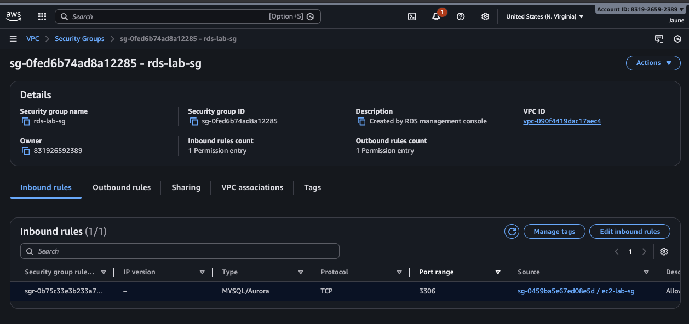
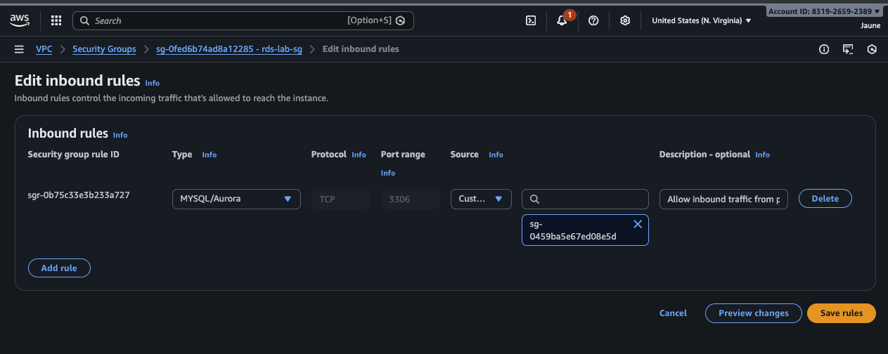
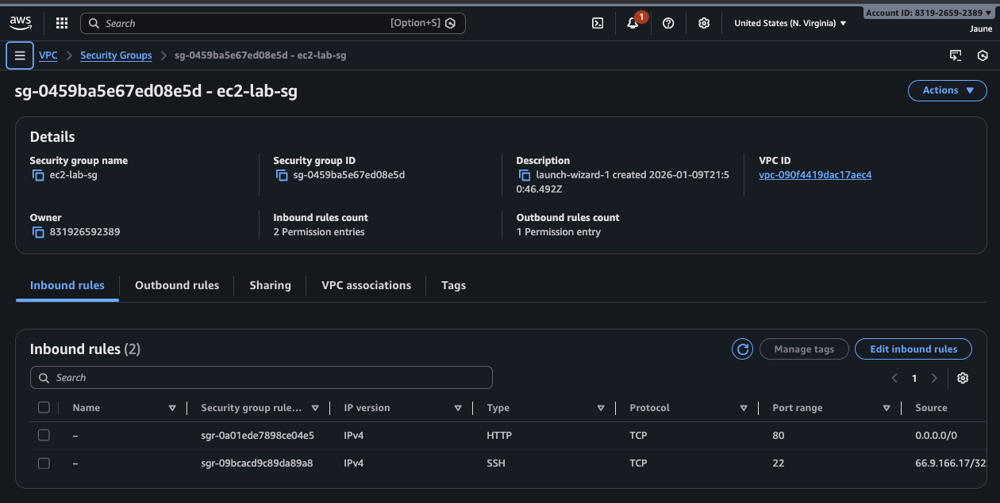
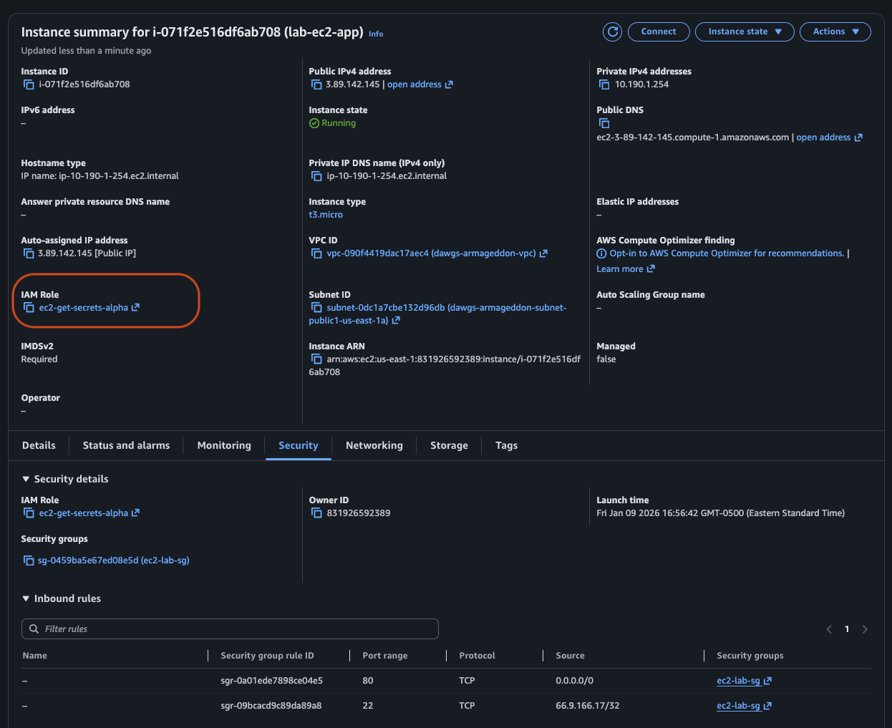
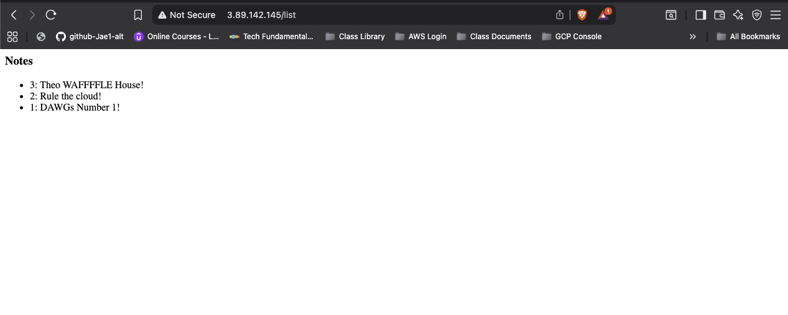

## 📸 Lab Screenshots

### a. 🛡️ RDS Security Group Inbound Rule
**Source:** `ec2-lab-sg` | **Port:** `3306`

This inbound rule restricts traffic strictly to the security group `ec2-lab-sg` on port **3306**. This ensures only our specific EC2 instances can communicate with the database.

#### 🔍 "ec2-lab-sg" Details:

> **Note:** This security group allows inbound **HTTP (Port 80)** traffic from everywhere (`0.0.0.0/0`) and **SSH (Port 22)** traffic specifically from my public IP address.

---

### b. 🆔 EC2 IAM Role Attached

---

### c. 📝 App Verification (`/list` output)
*Success! The application is connected and retrieving data.*

---
---

## 🧠 Short Answers

### a. Why is DB inbound source restricted to the EC2 security group?
> This use of **Security Group Referencing** was done to adhere to the **Principle of Least Privilege**, ensuring that access to the database is only granted to the assigned instances.
>
> * **Dynamic IPs:** EC2 instances are ephemeral; if an instance is replaced, it receives a new IP. Relying on hardcoded IPs is unreliable.
> * **Subnet Risks:** allowing the entire subnet CIDR is risky, as any resource (malicious or not) inside that subnet could reach the database.
>
> Using the dedicated EC2 security group (`sg-id`) handles dynamic IP changes automatically while keeping the trust boundary tight.

### b. What port does MySQL use?
> MySQL uses port **3306**. 🐬

### c. Why is Secrets Manager better than storing creds in code/user-data?
> Storing credentials in application code or User Data keeps them in **plain text**, creating a high-risk vulnerability. If someone gains access to the instance or the source code repository (Git), they immediately compromise the database.
>
> **AWS Secrets Manager provides:**
> * 🔐 **Encryption** for secrets at rest.
> * 🔄 **Configurable Rotation** for automated security.
> * ⚡ **Runtime Retrieval**, allowing the app to fetch keys only when needed (in memory) rather than storing them on disk.

---

## ➕ Additional Insights

* 🚫 **Security Group Removal:** If the Security Group rules were removed, the instance and RDS database would have **no rules** governing access. Due to the default "Implicit Deny" behavior, they would default to blocking all traffic.
* 🔌 **RDS Isolation:** If the RDS database rules were removed, the EC2 instance could not communicate with the DB. Attempting to use the web app would result in a **"500 Internal Server Error"**.
* 🕸️ **Public Access:** If you removed the security group rules on the EC2, the instance would stop accepting traffic. Trying to load the public IP in a browser would result in a timeout (infinite loading).
* 💥 **Blast Radius:** Broader access to the DB or Secrets Manager violates the **Principle of Least Privilege**. Granting more access than is needed increases the potential **blast radius** and damage, should the resource be compromised by bad actors or become defective.
* 🔑 **IAM Roles:** The role used in this lab grants the EC2 instance permission to retrieve specific secrets from **Secrets Manager**. The app code then uses these secrets to authenticate with the RDS Database.
* 📜 **Role Authority:** When a role is attached to a resource, the resource's permissions are **defined exclusively** by the policies attached to that role. The resource can **only** perform actions explicitly allowed by the role; all other actions are implicitly denied.