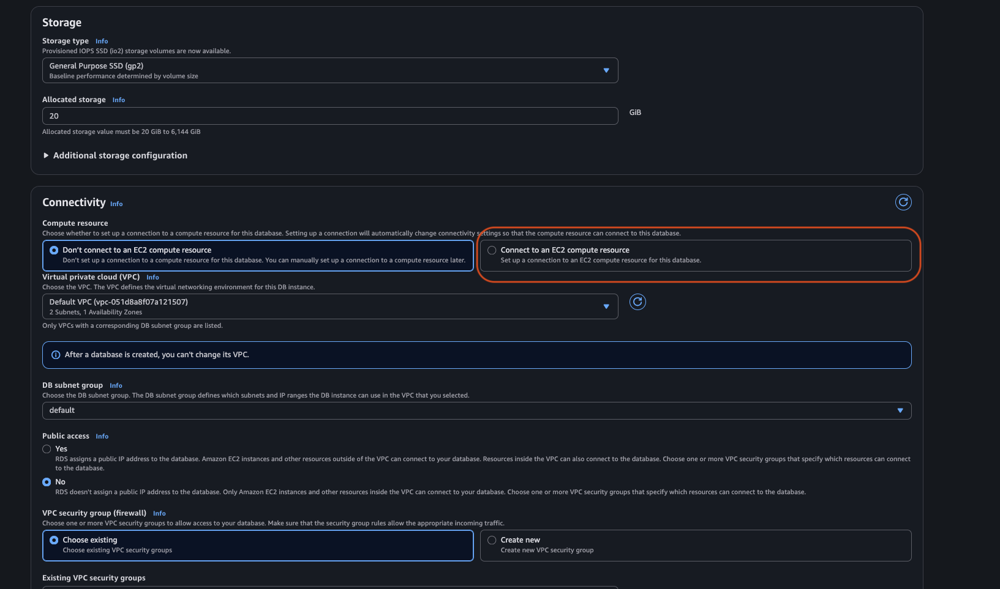

### 🏗️ Infrastructure Diagram (Lab 1.a)


The diagram above illustrates the final infrastructure state upon successful completion of Lab 1.a.

**Key Architecture Points:**

- **Public Subnet (App Tier):** The EC2 instance resides here, allowing inbound HTTP traffic (Port 80) from `0.0.0.0/0` (Anywhere).
    
    - _Note:_ SSH (Port 22) access is enabled but should be strictly limited to the administrator's specific IP address for security. If using **AWS EC2 Instance Connect** (browser-based SSH), you must allow traffic from AWS's IP range for that service (or use 0.0.0.0/0 for simplicity in this case).
    
- **Secrets Management:** Database login credentials are stored securely in **AWS Secrets Manager**. The EC2 instance retrieves these credentials at runtime via an attached **IAM Role** with a specific permission policy, eliminating the need for hardcoded secrets.
    
- **Private Subnet (Data Tier):** The RDS database resides here. Its Security Group is configured to accept traffic **only on Port 3306** and **only from the EC2 instance's Security Group**. This ensures the database is inaccessible from the public internet.
    

---

### ⚙️ Process Optimizations & Adjustments

While the original walkthrough was functional, several strategic adjustments were made to streamline the deployment and ensure compatibility with modern AMIs.

#### 1. Deployment Order (EC2 vs. RDS)

One potential workflow improvement is to provision the **EC2 Instance** _before_ creating the RDS Database.

- Benefit: This enables the "Connect to an EC2 compute resource" feature in the RDS console during setup.
    
    
    
- **⚠️ Important Trade-off:** Using this automated feature creates two new Security Groups automatically to bridge the connection. If you have already manually created your Security Groups (as done in this lab), using this feature will result in redundant/duplicate Security Groups.
    

#### 2. Manual DB Subnet Group

We manually created a **DB Subnet Group** to explicitly control the placement of the RDS instance. This prevents AWS from assigning the database to random subnets across Availability Zones, ensuring the data tier remains strictly within our defined private network boundary.

#### 3. MariaDB Client Compatibility

The original walkthrough referenced a `mysql` client installation that is no longer compatible with **Amazon Linux 2023**.

- **The Fix:** We updated the `user_data.sh` script to use the MariaDB client, which is a drop-in replacement for MySQL on this OS.
    
- **Command Added:** `dnf install mariadb105 -y`, adding among the first 5 commands n the script. An example of the updated script is in the  'user_data_up.sh' file
    

---

### 🔧 Troubleshooting: Manual Database Initialization

If visiting `http://<public_ip>/init` does not automatically create the `labdb` table, you can manually initialize the database via the CLI.

**Steps to resolve:**

1. **Log into the EC2 instance** via SSH.
    
2. **Connect to the RDS instance:**
    
    Bash
    
    ```
    mysql -h <RDS_ENDPOINT> -u <USER> -p
    ```
    
    _(Enter your password when prompted)_
    
3. **Verify existing databases:**
    
    SQL
    
    ```
    SHOW DATABASES;
    ```
    
4. **Create the missing database:**
    
    SQL
    
    ```
    CREATE DATABASE labdb;
    ```
    
5. **Verify creation and exit:**
    
    SQL
    
    ```
    SHOW DATABASES;
    EXIT;
    ```
    
6. Restart the Application Service:
    
    Force the application to reconnect to the newly created database:
    
    Bash
    
    ```
    sudo systemctl restart rdsapp
    ```
    

Once these steps are complete, visit the initialization URL again. You should now be able to add and list notes successfully.

**Example Success Output:**

