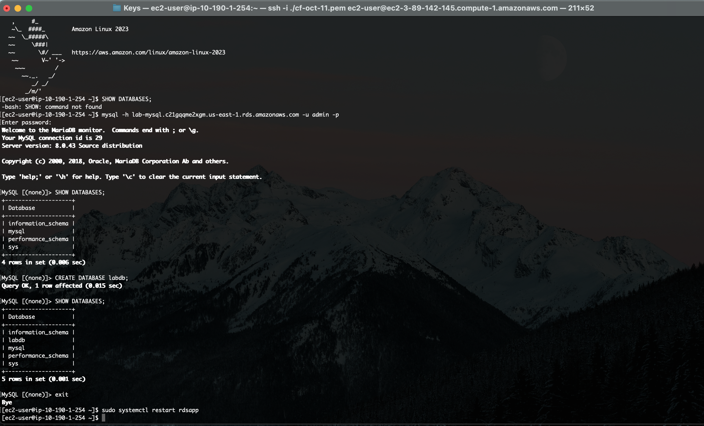

### 🏗️ Infrastructure Diagram (Lab 1.a)


The diagram above illustrates the final infrastructure state upon successful completion of Lab 1.a.

**Key Architecture Points:**

- **Public Subnet (App Tier):** The EC2 instance resides here, allowing inbound HTTP traffic (Port 80) from `0.0.0.0/0` (Anywhere).
    
    - _Note:_ SSH (Port 22) access is enabled but should be strictly limited to the administrator's specific IP address for security. If using **AWS EC2 Instance Connect** (browser-based SSH), you must allow traffic from AWS's IP range for that service (or use 0.0.0.0/0 for simplicity in this case).
    
- **Secrets Management:** Database login credentials are stored securely in **AWS Secrets Manager**. The EC2 instance retrieves these credentials at runtime via an attached **IAM Role** with a specific permission policy, eliminating the need for hardcoded secrets.
    
- **Private Subnet (Data Tier):** The RDS database resides here. Its Security Group is configured to accept traffic **only on Port 3306** and **only from the EC2 instance's Security Group**. This ensures the database is inaccessible from the public internet.
    

---

## ⚙️ Process Optimizations & Adjustments

While the original deployment walkthrough was functional, we have implemented several strategic adjustments to streamline the workflow, enhance security boundaries, and ensure compatibility with modern Amazon Machine Images (AMIs).

### 1. Deployment Order: EC2 Prioritization

A key workflow improvement involves provisioning the **EC2 Instance** _before_ creating the RDS Database.

- **The Benefit:** This sequence unlocks the _"Connect to an EC2 compute resource"_ feature within the RDS console setup. This automates the network bridging between the compute and data tiers.
    
- **⚠️ Important Trade-off:** Using this automated feature creates two new Security Groups automatically.
    
    > **Note:** If you have already manually created your Security Groups (as done in this lab), using this feature will result in **redundant/duplicate Security Groups**. Use this feature only if you want AWS to handle the security group creation for you.
    

#### ⚠️ Critical: Infrastructure Dependencies & Application State

Whether using this optimized workflow or the original walkthrough, strict resource ordering is required. The application expects specific infrastructure to be fully operational **before** the EC2 instance launches.

Prerequisites for Successful Launch:

Before the EC2 instance boots and the application service starts, the following must be correctly configured and active:

- Security Groups and Rules (allowing ingress/egress on correct ports).
    
- IAM Roles (with proper policies attached to the EC2).
    
- The RDS Instance (created, available, and placed in the correct DB Subnet Group).
    
- Secrets Manager credentials (if applicable).
    

The "Cached Failure" State:

If the EC2 launches before these resources are ready, the application will attempt to connect to the database, fail, and cache this failed state in memory.

Even if you rectify the underlying resource issues (e.g., fixing a Security Group rule) after the fact, visiting `http://<public_ip>/init` may still fail because the running application process is stuck in its previous "disconnected" state.

Resolution:

To force the application to drop its cached state and re-establish a connection to the database, you must restart the service. You can achieve this via one of two methods:

1. **Service Restart (via SSH):** Run `sudo systemctl restart rdsapp`
    
2. **Instance Reboot (easiest):** Reboot the EC2 instance via the AWS Console to flush the state and re-run initialization.
    

### 2. Manual DB Subnet Group Configuration

We explicitly created a **DB Subnet Group** rather than relying on defaults.

- **Why:** This ensures the RDS instance is placed strictly within our defined private network boundary.
    
- **Result:** It prevents AWS from inadvertently assigning the database to random subnets across Availability Zones that may not align with our architecture.
    

---

### 3. Amazon Linux 2023 Compatibility (Critical Fix)

The original documentation referenced a `mysql` client installation that is deprecated and incompatible with **Amazon Linux 2023 (AL2023)**. AL2023 has replaced the legacy MySQL client with MariaDB.

#### 📄 User Data Script Updates

To support the application initialization logic, the `user_data.sh` script requires a specific update. The `mariadb105` package acts as a drop-in replacement for the MySQL client.

Required Change:

You must replace the legacy yum install mysql command with the dnf command below. This should be placed within the first 5 lines of your script to ensure dependencies are present before the application attempts to launch.

Additional code has also been added to display the error message when using the `http://<public_ip>/init` url, on the webpage.

---

## 🔧 Troubleshooting: Manual Database Initialization

If for some reason the application's auto-initialization at `http://<public_ip>/init` fails to create the necessary tables, you must manually initialize the database via the Command Line Interface (CLI) on the appropriate EC2.

**Steps to Resolve:**

1. Access the Compute Tier:
    
    Log into your EC2 instance via SSH (or Instance Connect if enabled).
    
2. Connect to the Data Tier:
    
    Use the MariaDB client installed via the User Data script to connect to RDS.
    
    
    ```bash
    mysql -h <RDS_ENDPOINT> -u <USER> -p
    ```
    
    _(Enter your password when prompted)_
    
3. Verify Current State:
    
    Check if the database exists.
    
    
    ```SQL
    SHOW DATABASES;
    ```
    
4. Create the Database:
    
    If labdb is missing, create it manually.
    
    
    ```SQL
    CREATE DATABASE labdb;
    ```
    
5. **Confirm and Exit:**
    
    
    ```SQL
    SHOW DATABASES;
    EXIT;
    ```
    
6. Restart the Application:
    
    Force the application service to reconnect to the newly created database context.
    
    
    ```bash
    sudo systemctl restart rdsapp
    ```
    

Example Success Output:




Verification:

Once these steps are complete, revisit the initialization URL (/init). You should now be able to add and list notes successfully.


---