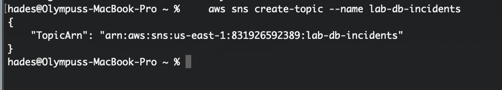
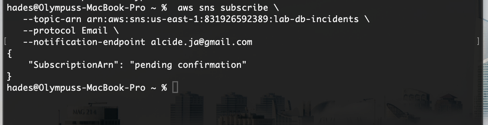
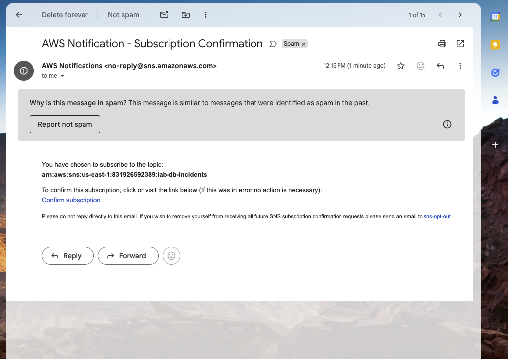
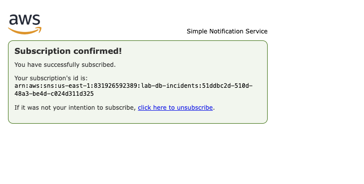
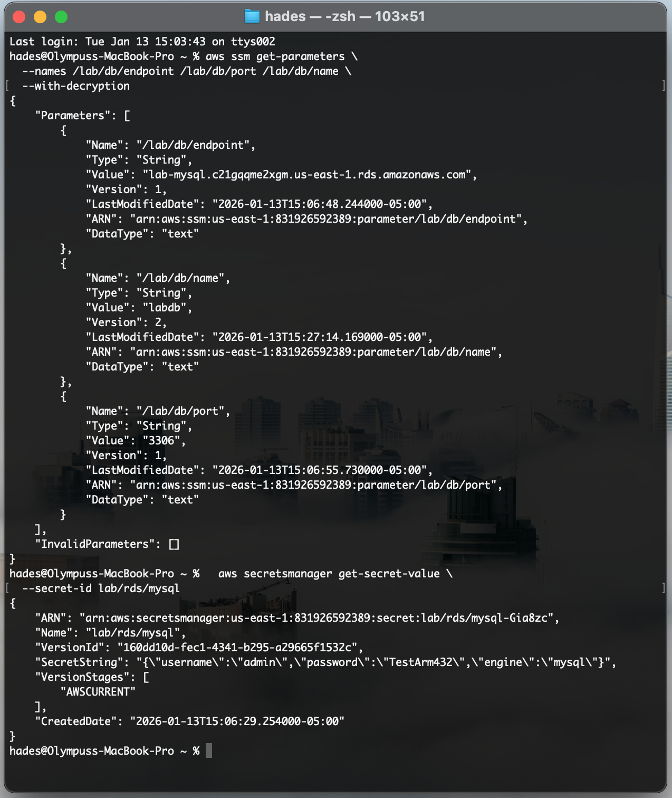
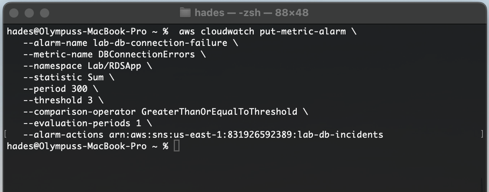
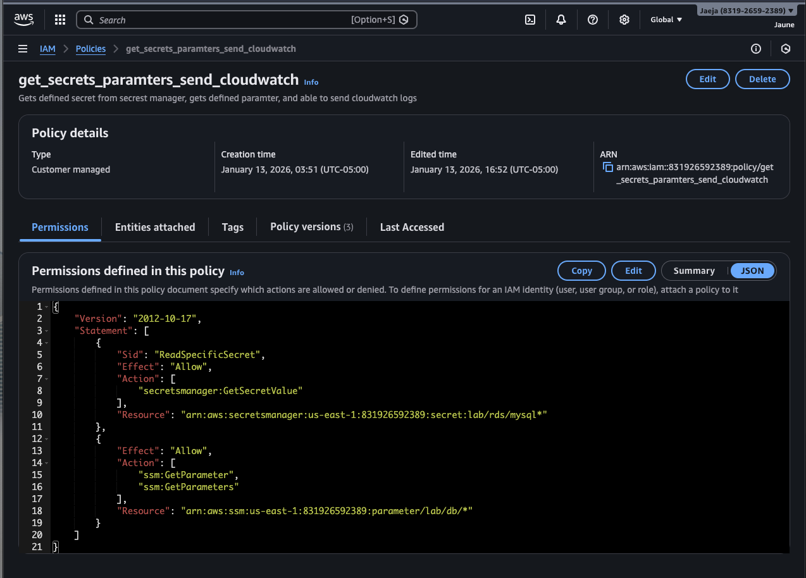
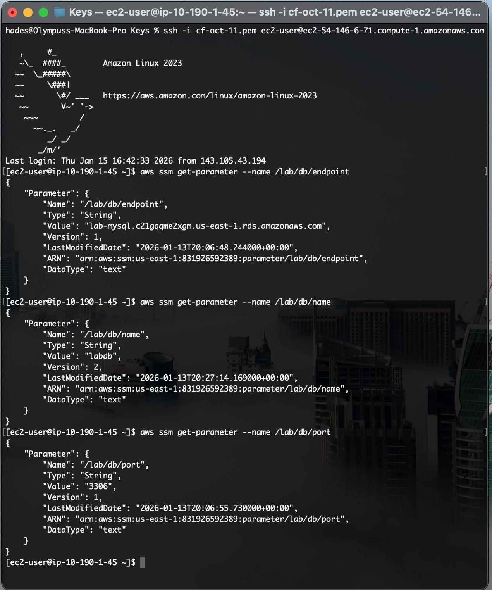

### **Part 1: The Architectural Evolution (1a $\to$ 1b)**

**1.1 Security & Configuration Hardening**

**Goal:** Transition from a monolithic secrets model to a tiered, cost-optimized architecture.

**Action 1: Establishing the Notification Channel (SNS)**

Before re-architecting the application configuration, I established an alerting pipeline to ensure immediate observability of any failures during the transition.

- **Result:** Created SNS Topic `arn:aws:sns:us-east-1:<ACCOUNT_ID>:lab-alerts` to serve as the destination endpoint for future CloudWatch Alarms.
    

Following the topic creation, I subscribed to the notifications using the Email protocol to ensure alerts are delivered to an external inbox.

**Verification:** Subscription confirmation received and validated via email.

**Action 2: Optimizing Secret Storage (The "Split" Strategy)**

In Lab 1a, all configuration data (sensitive and non-sensitive) was stored in AWS Secrets Manager. While secure, this approach treats static infrastructure data (like endpoints) as expensive secrets. In Lab 1b, I implemented a **split-storage strategy**:

- **Secrets Manager:** Retained _only_ high-value credentials (Username/Password).
    
- **Parameter Store:** Designated for non-sensitive infrastructure data (Endpoints, Ports, DB Names).
    

Refining the Secret Payload:

I updated the existing secret in Secrets Manager to remove the infrastructure details, adhering to the principle of Data Minimization.

- **Architectural Benefit:** This reduces the "Blast Radius" of a potential credential leak. It also prepares the environment for cost optimization, as storing endpoints in Parameter Store (Standard) is free, whereas Secrets Manager incurs a monthly cost per secret.
    

> **Architectural Note:** The `engine` key and its associated value were retained in Secrets Manager for the purpose of this lab simulation. In a fully optimized production environment, this non-sensitive metadata would also be migrated to Parameter Store to further reduce costs.

**Action 3: Configuring Automated Alerting**

To complete the hardening phase, I defined a CloudWatch Alarm linked to the SNS topic created in Action 1. This alarm monitors the custom metric `DBConnectionErrors` and is configured to trigger if the error count exceeds a **threshold of 3 errors within a 5-minute period**. This ensures that transient glitches are ignored, but persistent connectivity issues immediately notify the operations team.

**Action 4: Application Refactoring (Code-Level Integration)**

With the infrastructure changes in place, I refactored the application code to align with the new tiered architecture. The key modifications included:

- **Dual-Source Retrieval:** Integrated the AWS SDK (`boto3`) to retrieve non-sensitive configuration (Endpoint, Port, DB Name) from **Parameter Store**, while continuing to fetch high-value credentials from **Secrets Manager**.
    
- **Logic Migration:** Removed the legacy logic that looked up infrastructure details in Secrets Manager, ensuring the app relies solely on SSM for location data.
    
- **Structured Logging:** Instrumented the application to emit specific error signatures (`DB_CONNECTION_FAILURE`) to local log files. These files are targeted by the **Unified CloudWatch Agent** (installed and configured via the provisioning script), ensuring seamless ingestion into CloudWatch Logs.
    

> **Code Reference:** The updated user data script containing the refactored application logic is archived in the `user_data_prop.sh` file.

**Action 5: Amending IAM Role Permissions**

The final component of the upgrade was updating the **EC2 Instance Profile** to support these new capabilities. Since the application now interacts with multiple AWS services, the instance required expanded permissions:

1. **Configuration Access:** Updated the inline policy to allow `ssm:GetParameter`. This grants the application permission to read the new values stored in Parameter Store.
    
2. **Observability Access:** Because the CloudWatch Agent (running on the instance) needs to push log streams to the cloud, I attached the **AWS Managed Policy** `CloudWatchAgentServerPolicy`. This provides the instance with the necessary `logs:PutLogEvents` and `cloudwatch:PutMetricData` permissions.
    

Role Validation:

Policy Verification:

(Showing scoped permissions for GetParameter and GetSecretValue)

Operational Validation:

(Instance successfully retrieving Secrets and Parameter values via CLI)

---

**1.2 Baseline State Verification**

Before initiating the incident response drills, I confirmed the system was in a healthy state. The CloudWatch Alarm reported OK, indicating no connectivity errors were present.

