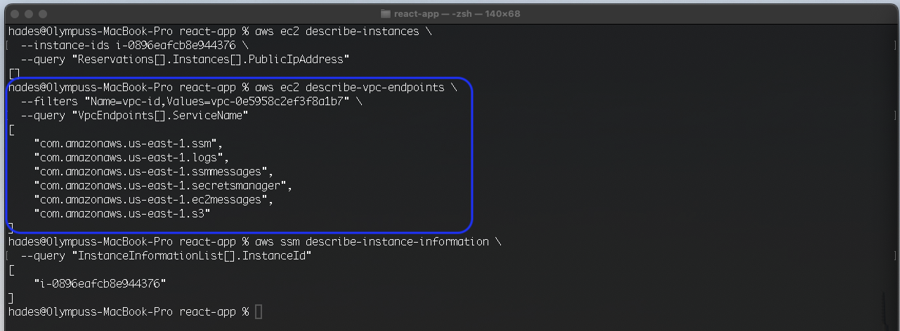
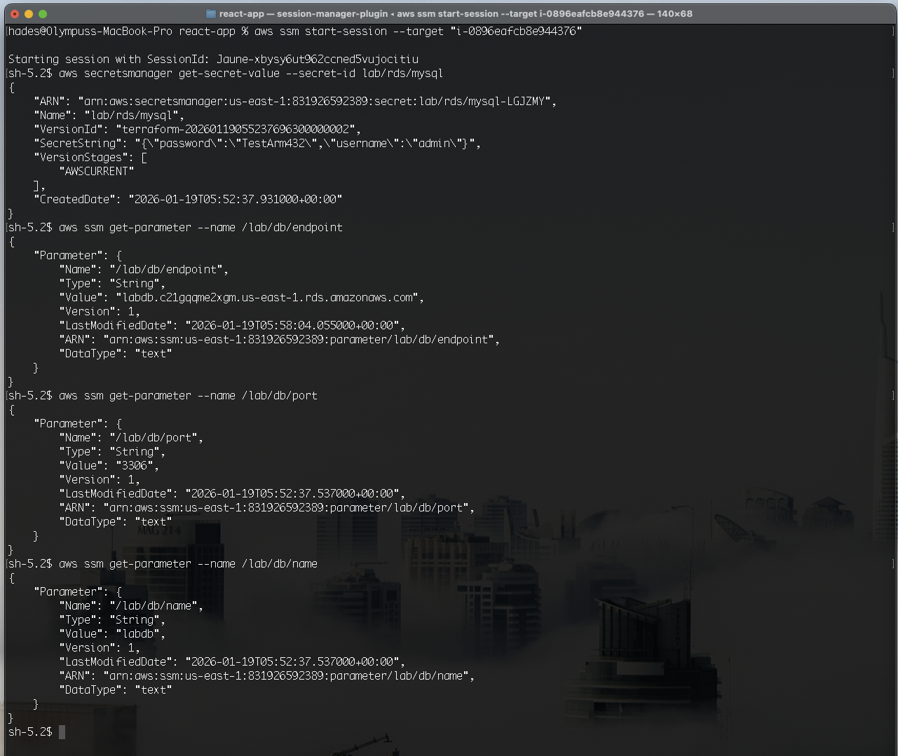
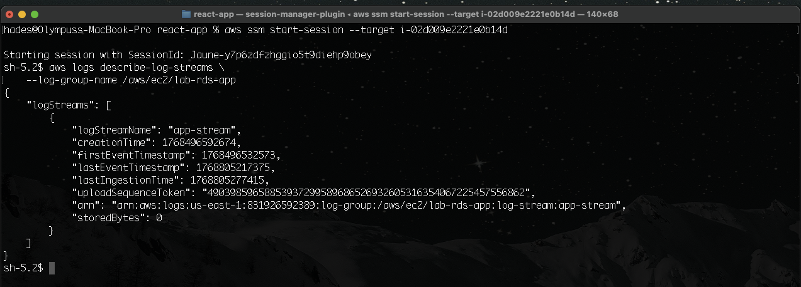
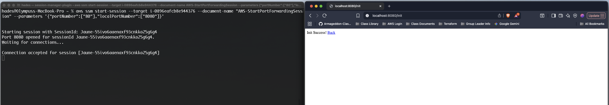

## Lab 1.c-Bonus A

In this section of the lab, I built upon Lab 1.b by engineering an AWS environment focused on observability, security, and **Zero-Trust**. I migrated a public-facing, HTTP-accessible instance to an isolated private subnet with no rules allowing inbound (ingress) traffic. Additionally, I implemented **AWS PrivateLink** to access required resources via **VPC Endpoints** and enforced IAM role-based **Least Privilege** principles to strictly limit credential and resource access.

Resource and infrastructure orchestration was accomplished using **Terraform** and modularized configurations. The infrastructure deployment successfully achieved the design goals outlined for Lab 1.c Bonus A:

>"EC2 is private (no public IP)
  No SSH required (use SSM Session Manager)
  Private subnets don’t need NAT to talk to AWS control-plane services
  Use VPC Interface Endpoints for:
    SSM, EC2Messages, SSMMessages (Session Manager)
    CloudWatch Logs
    Secrets Manager
    KMS (optional but realistic)
Use S3 Gateway Endpoint (common “gotcha” for private environments)
Tighten IAM: GetSecretValue only for your secret, GetParameter(s) only for your path"

### Terraform Architecture

This project was built using a modular Terraform structure. Parent and child modules are organized into distinct directories to enhance readability and maintainability. The root module is located at the `Terraform/main_config` path.

---

### Project Deliverables & Verification

- **VPC Endpoint Connectivity:** Note the created and connected VPC Endpoints, evidenced by their Private DNS names (bordered in red) and their associated VPC Interface Endpoint IDs (bordered in bright blue).
    > 

- **Network Isolation:** Verification via AWS CLI that the EC2 instance is private with no public IP address assigned, as evidenced by the empty response (command and results bordered in green).
    
    > 

- **Endpoint Validation:** CLI verification of the existence and status of the configured endpoints (command and results bordered in blue).
    
    > 

- **SSM Fleet Integration:** Verified SSM connection to instances managed by **SSM Fleet Manager**. Note that the SSM Agent comes pre-installed on Amazon Linux 2023. (CLI command and response bordered in yellow).
    
    > 

- **VPC Health Check:** Commands executed to provide evidence that VPC Endpoints are active, available, and correctly associated with the VPC.
    
    > 

- **Interactive Session:** A successful interactive SSM session established using the default `StartSession` command.
    
    > 

- **Secure Data Retrieval:** Demonstrated successful retrieval of credentials from Secrets Manager and Parameter Store directly from the EC2 instance (via Session Manager), highlighting functional endpoint connectivity and role-based access.
    
    > 

- **Log Egress Path:** Evidence confirming that the CloudWatch logs delivery path is routed through the VPC Endpoint.
    
    > 

---

### Advanced Verification (For Fun)

Utilizing **SSM Port Forwarding** to establish a secure Port 80 connection to the application, leveraging the `AWS-StartPortForwardingSession` document:

- **Parameter Mapping:** Gathering the required values to initiate the session.
    > 

- **Secure Tunneling:** Executing the command to establish a local browser connection to the application. This proves the application is accessible to authorized administrators despite being in a private subnet with **zero inbound firewall rules**.
    
    > 
    

---
---
