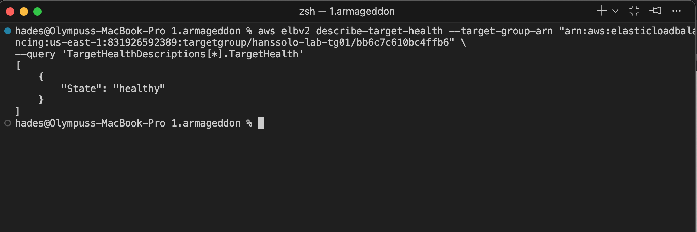
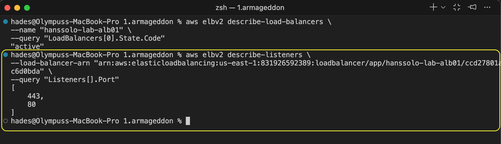
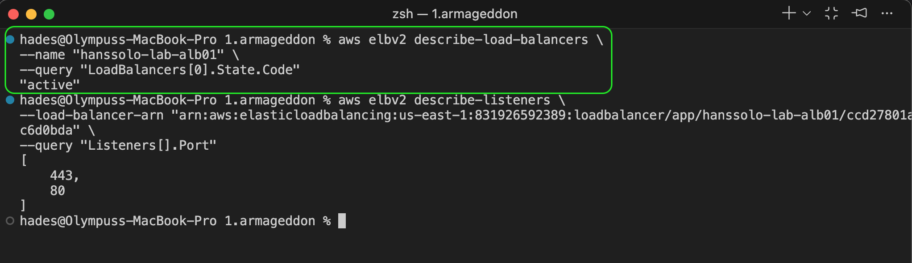
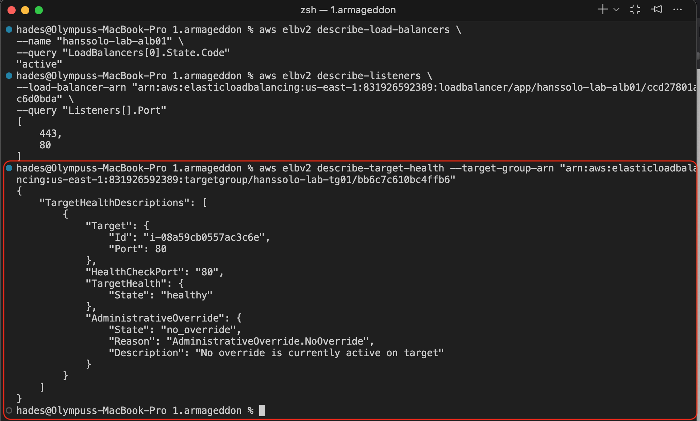
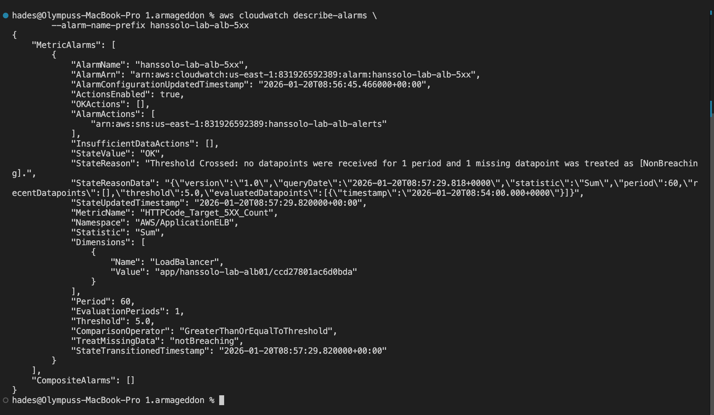
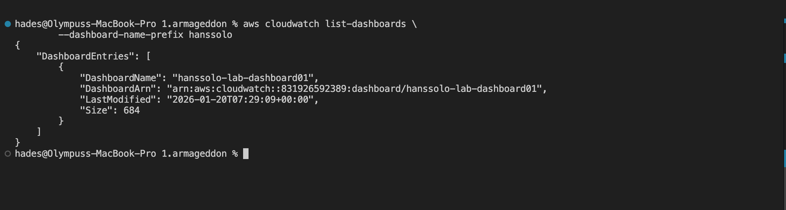

# Secure Edge Architecture: Implementing ALB, WAFv2, and Forensic Logging

This lab further builds on the foundation of **Lab 1c Bonus A** by integrating an **Application Load Balancer (ALB)** in the public subnet, acting as the entry point for the EC2 instance isolated in the private subnet. To secure this public entry point, I architected and deployed a **Regional WAFv2 Web ACL** directly in front of the ALB.

Instead of authoring custom firewall rules from scratch, I implemented the **AWSManagedRulesCommonRuleSet** to protect against common OWASP vulnerabilities. Furthermore, I engineered a high-fidelity logging pipeline to transform the WAF from a passive barrier into a fully observable security sensor. By creating a centralized **CloudWatch Log Group** and wiring the WAF Logging Configuration to it, I ensured the capture of full request metadata—including client IPs, headers, and blocking Rule IDs—enabling deep forensic analysis of all ingress traffic.

**N.B.** The Terraform code creating this infrastructure is in the `Terraform` directory.

### Verification Command and Results for Bonus B

- Proving the ALB exists and is active:
    > 

- Proving the HTTPS listener exists on 443 (highlighted with a yellow border):
    > 

- Proving the target is healthy (highlighted in green):
    > 

- Proof that the WAF is attached (highlighted in red):
    > 

- Alarm created (ALB Alarm):
    > 

- Galactic proof that the dashboard exists:
    > 