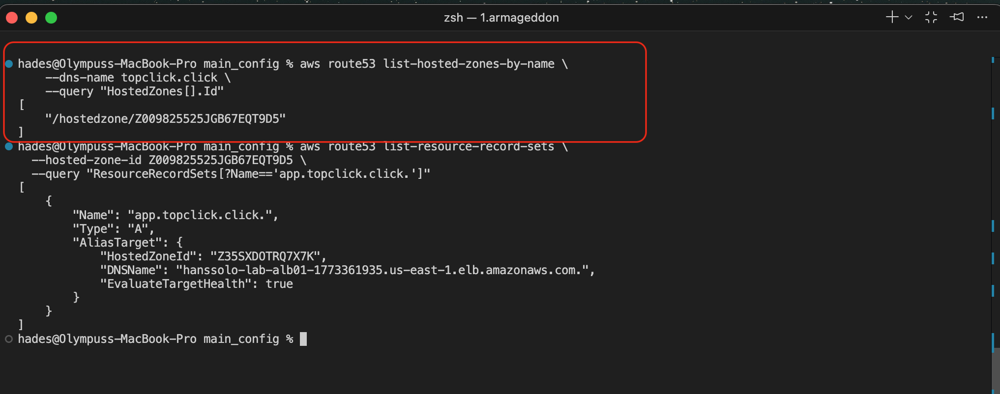
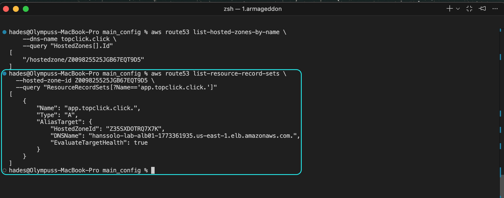
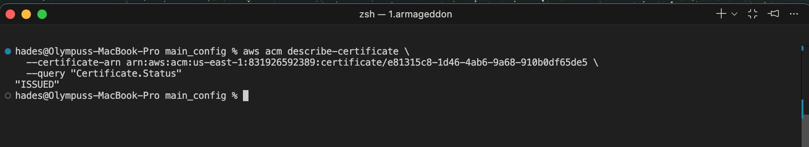
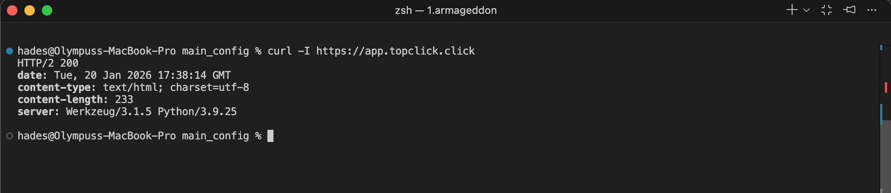
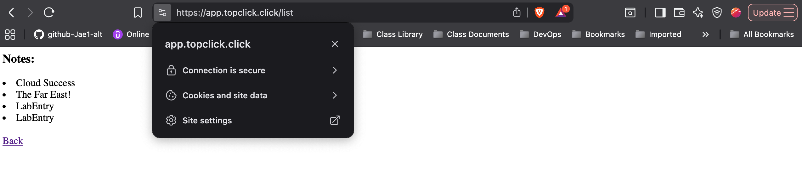

## Lab 1c Bonus C - Trusted Identity & Secure Traffic Flow

This lab further builds upon the secure Load Balancer deployment by integrating **Route 53** and **AWS Certificate Manager (ACM)** to establish a verifiable identity. While the Load Balancer provides a path to the application, using its default DNS name is neither human-friendly nor secure.

T address this issue, I registered the domain `app.topclick.click` and bound it to an SSL/TLS certificate managed by ACM. This configuration enforces a **Trusted Path** policy: if a user attempts to access the site via the raw AWS endpoint (`chewbacca-alb...amazonaws.com`), the browser will flag an **Identity Mismatch** and block the connection. This mirrors "Commercial Grade" standards (used by banks and major tech firms) where the application's "Identity" (Domain) must match its "Address" (Certificate).

This completes the secure feedback loop. The infrastructure is now:

1. **Private** (Backend instances isolated in private subnets).
    
2. **Gated** (WAF filtering attacks).
    
3. **Monitored** (CloudWatch Alarms watching for crashes).
    
4. **Verified** (Route 53 + ACM proving identity).
    

### Verification Command and Results

- **Proving the Redirection Logic:**
    
    - User enters `http://app.topclick.click` $\rightarrow$ ALB catches it $\rightarrow$ Redirects to HTTPS (301).
        
    - Browser requests `https://app.topclick.click` $\rightarrow$ ALB presents Cert $\rightarrow$ Browser trusts connection.
        

- Confirming the Hosted Zone Exists (highlighted in red):
  >
  
  - Confirming App record exists(highlighted in blue):
  >
  
  - Confirming certificate was issued:
  >
  
  - Confirming that HTTPS works:
  >
  
- Confirmation of secure domain access in web browser:
  >