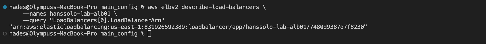
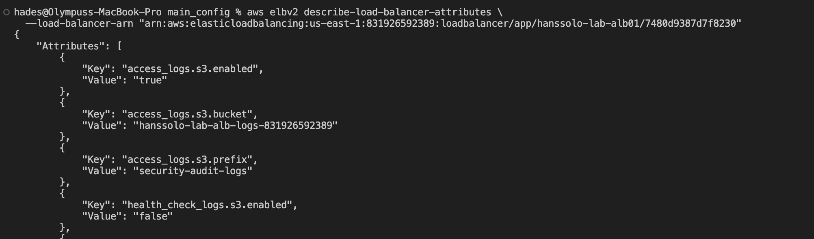
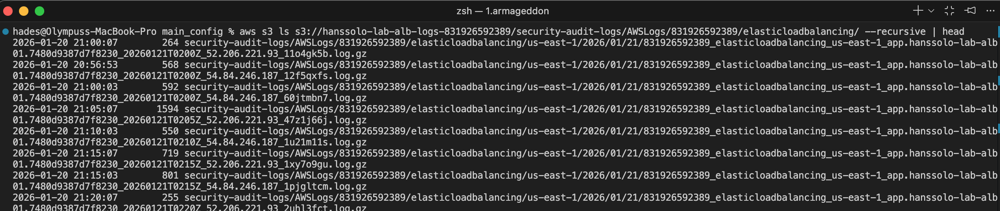
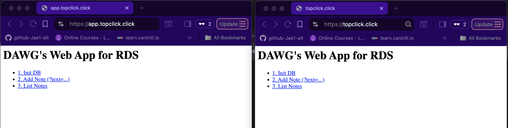

### Bonus D: Zone Apex Routing & High-Fidelity Observability

This lab finalizes the production-grade architecture by enabling root domain access and implementing a comprehensive logging strategy. While the previous setup secured the subdomain (`app.topclick.click`), a robust architecture must also handle traffic at the "Zone Apex" (the root `topclick.click`) and retain long-term traffic data for auditing.

To achieve this, I upgraded the SSL/TLS certificate to support **Subject Alternative Names (SANs)**, configured **Route 53 Alias Records** to handle root domain routing, and deployed a secure S3 bucket to act as a "Flight Recorder" for all ALB traffic. **AWS WAF (v2)** was also implemented to act as an active perimeter defense for the application.

### Verification Commands and Results

- Verifying Apex record exists:
  >
  
  - Verifying ALB logging is enabled:
  >
- ALB Attributes:
  >
  
- Domain names active and reachable:
  >
  
- Evidence of logs in S3 bucket:
  >
  
- Evidence of the 'app' + domain and the root domain working in web browser:
  >