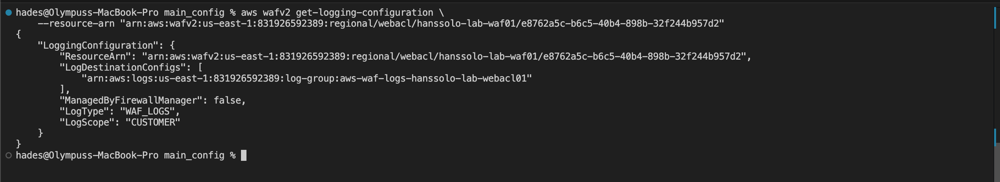
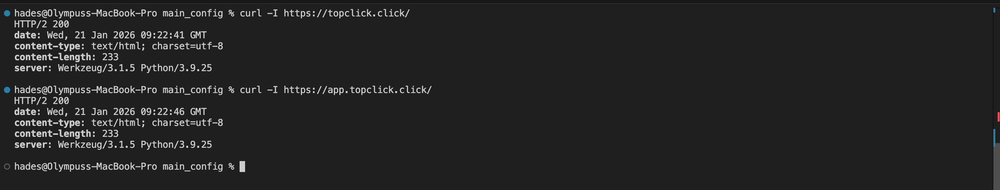
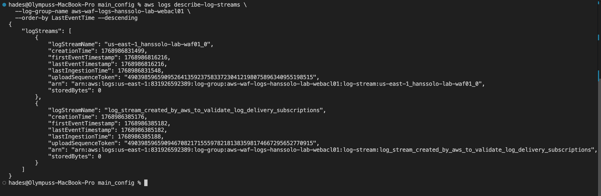
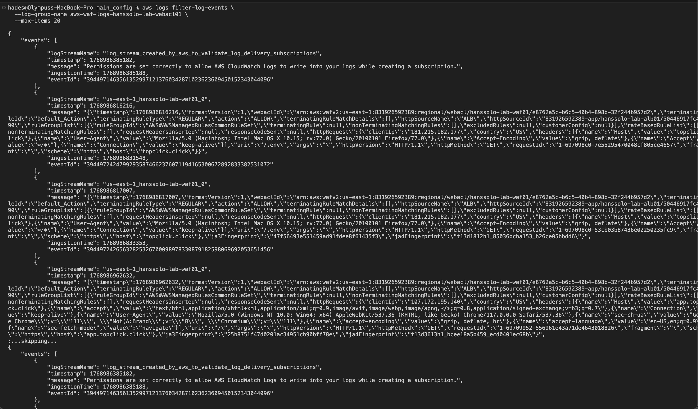
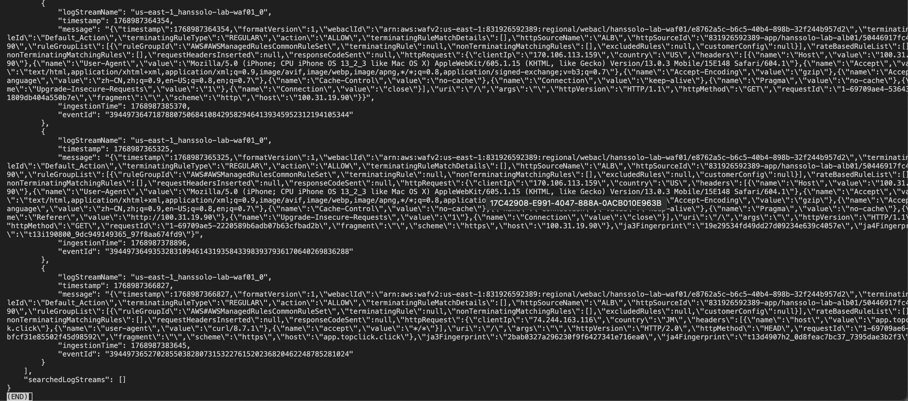

While WAF protects the site, simply "blocking" traffic isn't enough for a production environment. We need to know **who** was blocked, **which** specific rule they triggered, and **what** their intent was.

In this section, I implemented a flexible logging architecture that allows us to choose between three industry-standard destinations (CloudWatch, S3, or Kinesis Firehose). For this specific build, I chose **CloudWatch Logs** to enable real-time searching and rapid incident response.

By implementing this logging strategy, we have moved the infrastructure from a "Passive" state to an "Active" state. We no longer hope the WAF is working; we have the verifiable JSON evidence to prove it.

### Verification Commands and Results:

- Confirmation that WAF Logging is enabled:
  >
  
  - Generating traffic for the website:
  >
  
  - Describing CloudWatch Log Streams
  >
  
  - Retrieving and Filtering recent log events to newest 20:
  > 