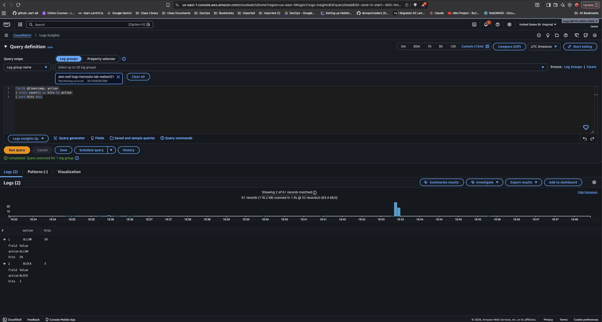
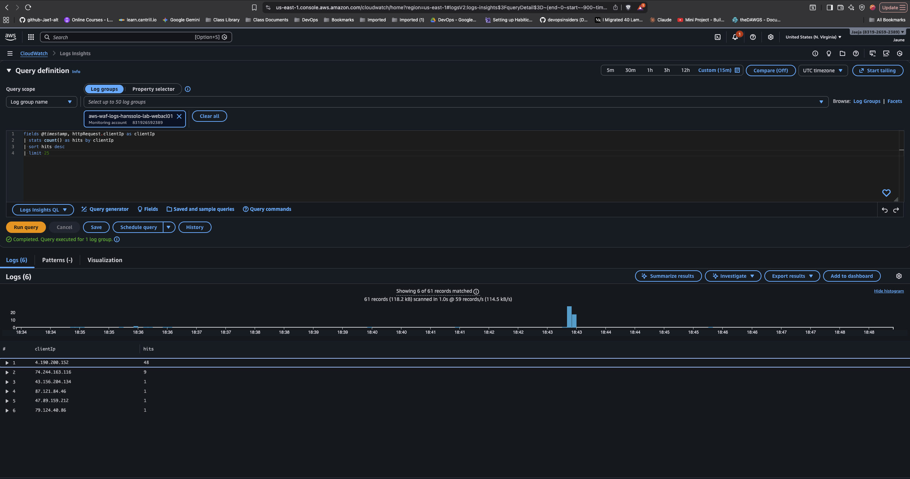
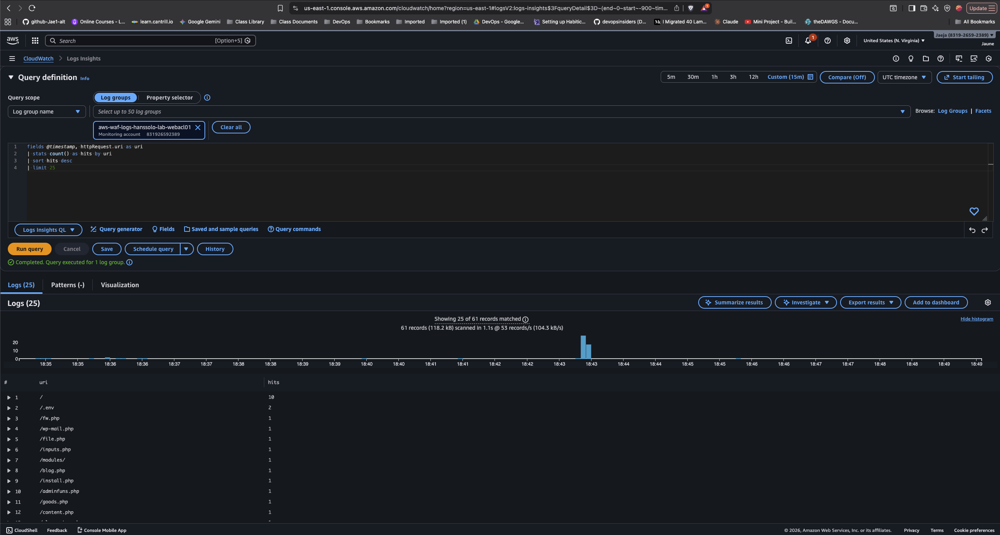
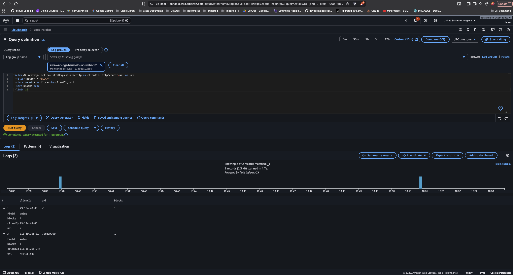
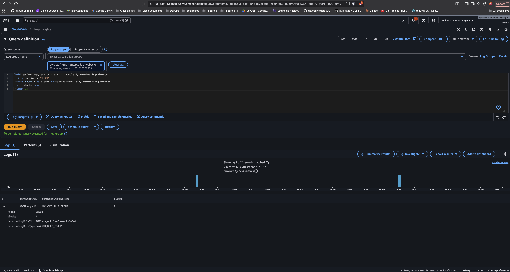
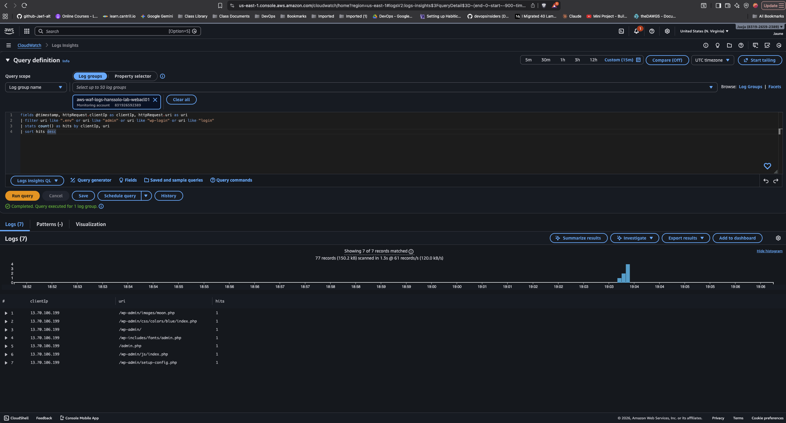
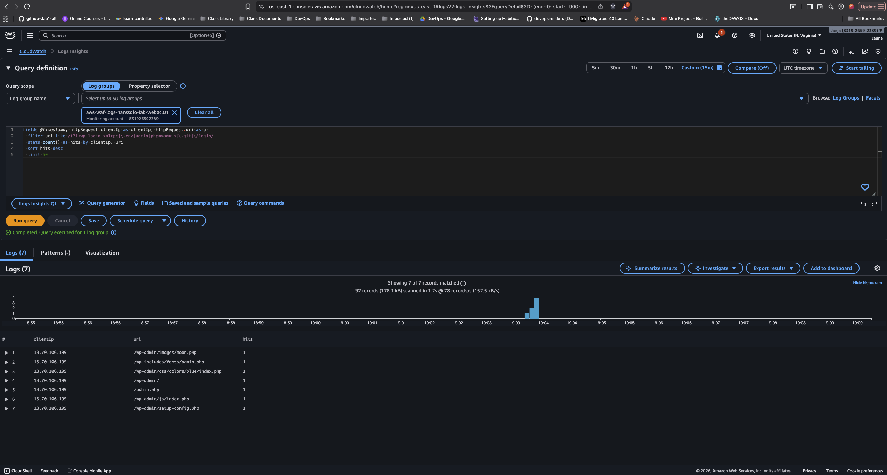
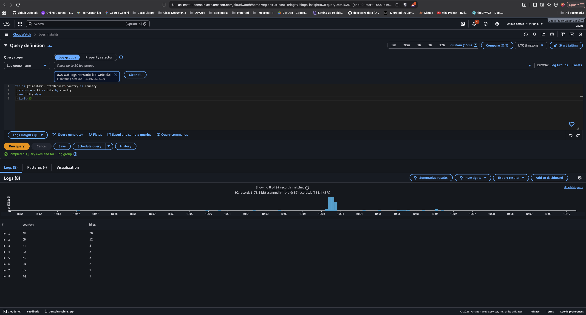
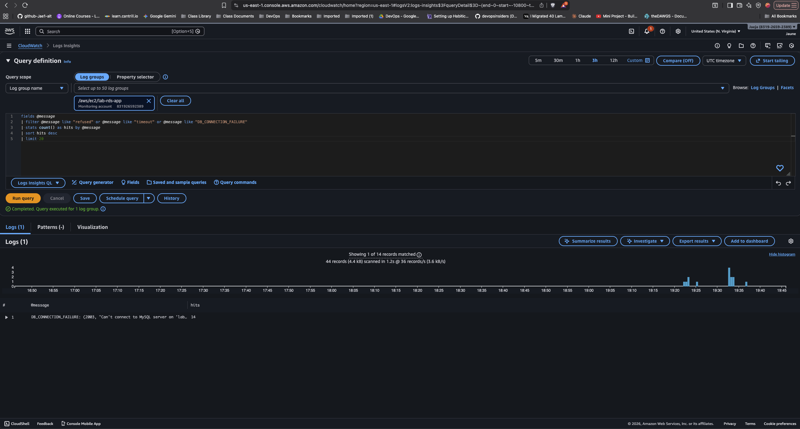
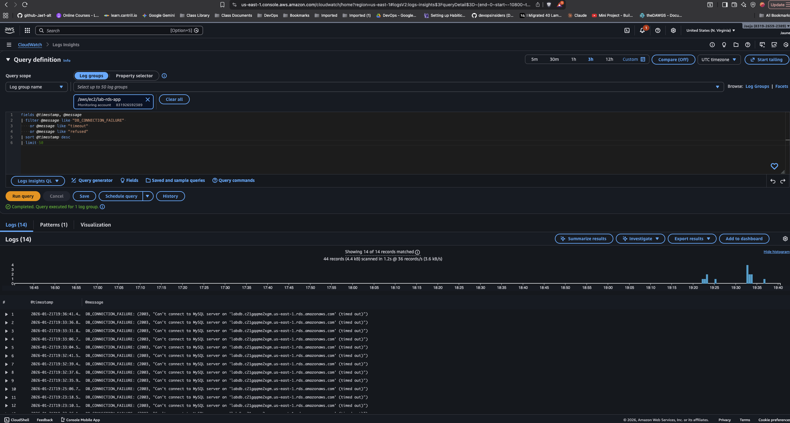

### Lab1c Bonus F - CloudWatch Logs Insights to add to Runbook

After numerous successful connections and purposeful wrong connections, CloudWatch Log insights consults; running commands to hits to the domain names ('app.topclick.click' and 'topclick.click'):
  >

Showing top client's IP address (the administrators IP was `74.244.163.116`):
  >

Showing the URL's the hits are trying to reach:
  >
  >

Evidence of which WAF rule is doing the blocking:
  >

Rate of blocks over time:
  >
  >

Showcasing hits per country. Note that the admin is in Jamaica (JM). Other countries are bad actors maybe?!
  >

---

**Before the following logs were retrieved, the inbound security group rule was disabled to simulate and incident.**

Count of errors over time:
  >

Showing the most recent Database failures:
  >

Retrieving the details if the logs; filtering the logs by specific error types. These showcase the retrieval of the 'time out' error logs; which is accurate given that the issue created was a security group failure.
  >
  

