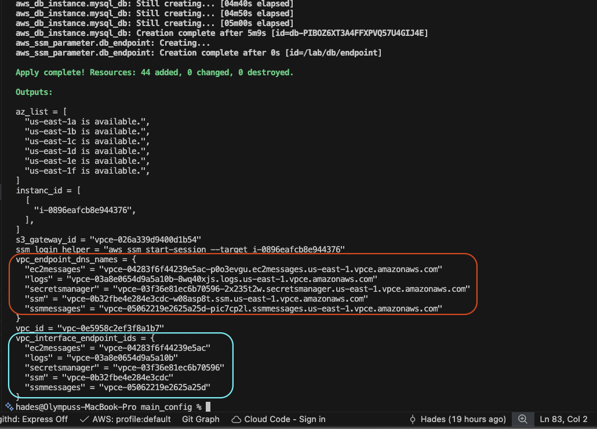
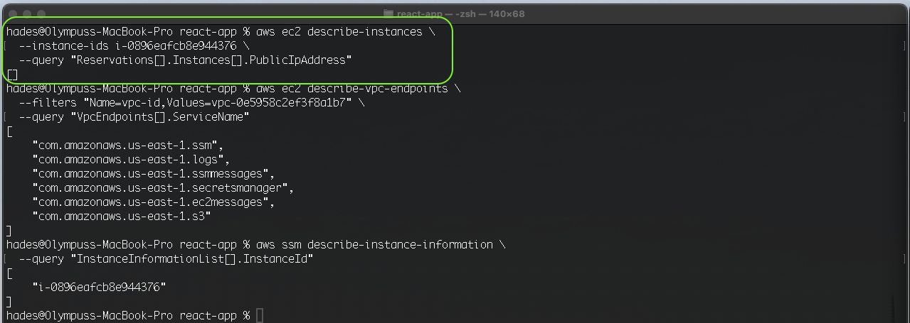
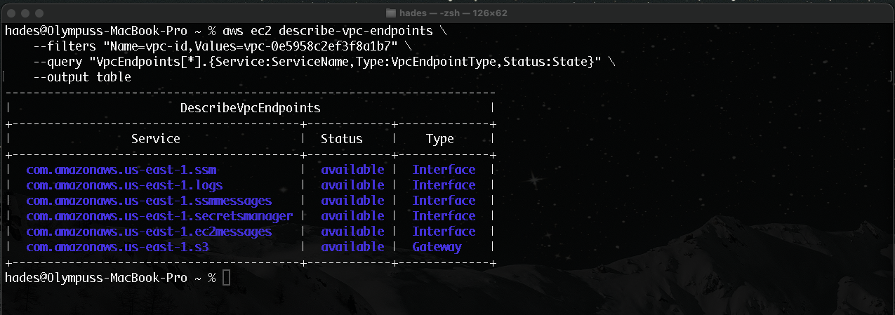
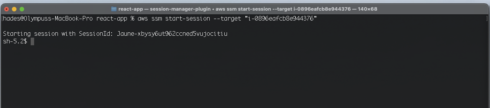

## Lab 1. c-Bonus A

In this section of the lab we built on Lab 1.b and engineered an AWS environment with observability, security and Zero -Trust, by migrating the public facing, http accessible, instance to an isolated, private network (subnet) with no rules allowing ingress traffic. We also implemented AWS PrivateLink access to needed resources using VPC Endpoints, and enforced IAM, role-based, least privilege principles to limit credentials and resource access.

Resource and infrastructure creation was accomplished using terraform, and terraform modules. infrastructure creation succeeded in accomplishing the design goals outlined in lab 1c bonus A"

>"EC2 is private (no public IP)
  No SSH required (use SSM Session Manager)
  Private subnets don’t need NAT to talk to AWS control-plane services
  Use VPC Interface Endpoints for:
    SSM, EC2Messages, SSMMessages (Session Manager)
    CloudWatch Logs
    Secrets Manager
    KMS (optional but realistic)
Use S3 Gateway Endpoint (common “gotcha” for private environments)
Tighten IAM: GetSecretValue only for your secret, GetParameter(s) only for your path"

### Some information on the Terraform

This project was created using terraform modules. As such parent and child modules placed in different but related directories for readability and accessibility. The root module is at the `Terraform/main_conifg` path.

### The Deliverables for the section are below:

- Note created and connected VPC Endpoints, evidenced by their DNS name (bordered in red), and their associated  VPC  interface endpoint ids (bordered in bright blue):
  >

- Next we verify via AWS CLI commands that the EC2 is private and has no public IP address, evidenced by the empty list (command and results bordered in green):
  >

- Next we verified that the endpoints existence, via the CLI (command and results bordered in blue ):
  >

- SSM connection was then verified to EC2 instance(s) managed by the SSM Fleet manager (i.e. instances with SSM Agent installed and connected to SSM Sessions Manager). It should noted that SSM Agent comes pre-installed with Amazon Linux 2023. The CLI command and response is bordered in yellow:
  >

- Commands were also run to provide evidence of VPC Endpoints connected to VPC, active and available:
  >

- A successful full SSM SSH session was then established (using the default, no SSM document, command):
  >

- Credentials stored in secrets and parameters, where then retrieved on the EC2 (via SSM Sessions Manager), highlighting endpoint connectivity and least privileged, role-based access:
  > 

- Evidence that CloudWatch logs delivery path is via the endpoint:
  >

#### For Fun:

Using port forwarding to establish a **port 80** connection to the application on the instance, all using the SSM's **'AWS-StartPortForwardingSession'** document:

- Getting the needed values for the command:
  >

- Launching the command and establishing browser connection to the application on the EC2 thats isolated in the private subnet (with no inbound traffic access):
>

---
---

## Lab 1.c-Bonus A

In this section of the lab, I built upon Lab 1.b by engineering an AWS environment focused on observability, security, and **Zero-Trust**. I migrated a public-facing, HTTP-accessible instance to an isolated private subnet with no rules allowing inbound (ingress) traffic. Additionally, I implemented **AWS PrivateLink** to access required resources via **VPC Endpoints** and enforced IAM role-based **Least Privilege** principles to strictly limit credential and resource access.

Resource and infrastructure orchestration was accomplished using **Terraform** and modularized configurations. The infrastructure deployment successfully achieved the design goals outlined for Lab 1.c Bonus A:

>"EC2 is private (no public IP)
  No SSH required (use SSM Session Manager)
  Private subnets don’t need NAT to talk to AWS control-plane services
  Use VPC Interface Endpoints for:
    SSM, EC2Messages, SSMMessages (Session Manager)
    CloudWatch Logs
    Secrets Manager
    KMS (optional but realistic)
Use S3 Gateway Endpoint (common “gotcha” for private environments)
Tighten IAM: GetSecretValue only for your secret, GetParameter(s) only for your path"

### Terraform Architecture

This project was built using a modular Terraform structure. Parent and child modules are organized into distinct directories to enhance readability and maintainability. The root module is located at the `Terraform/main_config` path.

---

### Project Deliverables & Verification

- **VPC Endpoint Connectivity:** Note the created and connected VPC Endpoints, evidenced by their Private DNS names (bordered in red) and their associated VPC Interface Endpoint IDs (bordered in bright blue).
    > 

- **Network Isolation:** Verification via AWS CLI that the EC2 instance is private with no public IP address assigned, as evidenced by the empty response (command and results bordered in green).
    
    > 

- **Endpoint Validation:** CLI verification of the existence and status of the configured endpoints (command and results bordered in blue).
    
    > 

- **SSM Fleet Integration:** Verified SSM connection to instances managed by **SSM Fleet Manager**. Note that the SSM Agent comes pre-installed on Amazon Linux 2023. (CLI command and response bordered in yellow).
    
    > 

- **VPC Health Check:** Commands executed to provide evidence that VPC Endpoints are active, available, and correctly associated with the VPC.
    
    > 

- **Interactive Session:** A successful interactive SSM session established using the default `StartSession` command.
    
    > 

- **Secure Data Retrieval:** Demonstrated successful retrieval of credentials from Secrets Manager and Parameter Store directly from the EC2 instance (via Session Manager), highlighting functional endpoint connectivity and role-based access.
    
    > 

- **Log Egress Path:** Evidence confirming that the CloudWatch logs delivery path is routed through the VPC Endpoint.
    
    > 

---

### Advanced Verification (Bonus)

Utilizing **SSM Port Forwarding** to establish a secure Port 80 connection to the application, leveraging the `AWS-StartPortForwardingSession` document:

- **Parameter Mapping:** Gathering the required values to initiate the session.
    > 

- **Secure Tunneling:** Executing the command to establish a local browser connection to the application. This proves the application is accessible to authorized administrators despite being in a private subnet with **zero inbound firewall rules**.
    
    > 
    

---
