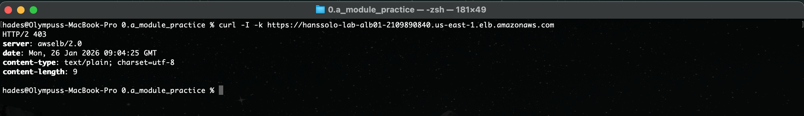
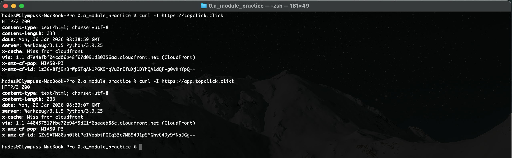
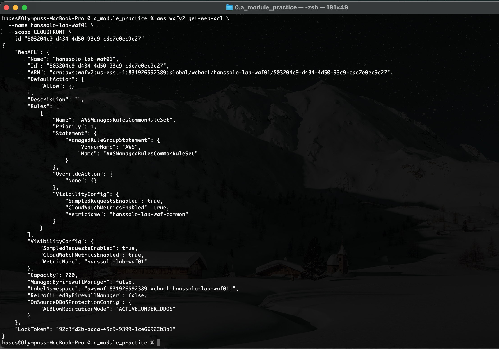
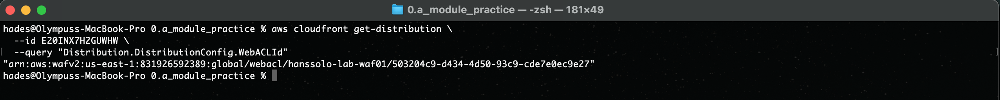
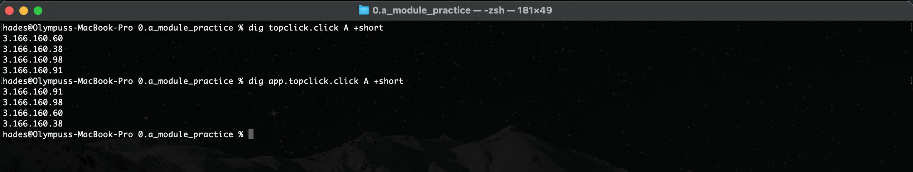

Deliverables for Lab 2a

## 1
- A) Direct ALB access should fail (403):
  >

- B) CloudFront access should succeed, both `app.topclick.click` & `topclick.click` succeeding:
  >

## 2
Evidence WAF moved to CloudFront:

- Evidence that the WAF is in the same region as the CloudFront Distribution, and is scoped to be used by CloudFront
  >

- Evidence that the CloudFront Distribution sees itself guarded by the WAF (referencing the WAF):
  >

## 3
- Both Domain Names point to Cloudfront, using the `dig <domain_name> A +short` command :
  >