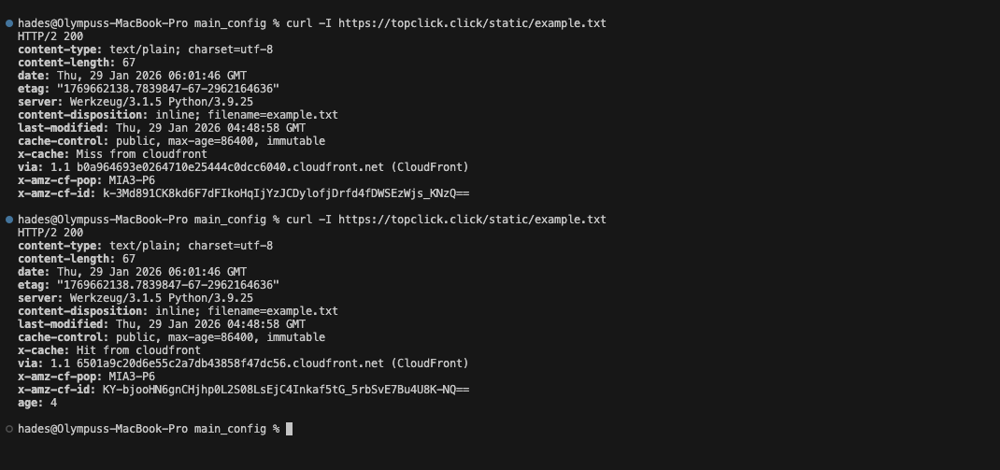

### Deliverable A
Please see the terraform code for this proof.

### Deliverable B

#### A)
 Static caching proof:
- For `/static/example.txt`
  >

- For `/api/list`
  >
 
#### B)

 **1. What is my cache key for `/api/*` and why?**
 My cache key for the API is effectively **empty (disabled)**. I used a Cache Policy with `min_ttl`, `default_ttl`, and `max_ttl` all set to **0**, and set all Cookies, Headers, and Query Strings to "None". This forces CloudFront to treat every request as a unique event and forward it directly to the origin, ensuring dynamic data is never stale.

 **2. What am I forwarding to origin and why?** 
 For the API, I am using an Origin Request Policy configured to **forward "allViewer" headers, all cookies, and all query strings**. I do this because the backend application (Flask) requires the full request context (like Authorization tokens, session cookies, or input parameters like `?text=...`) to execute the logic correctly. If I didn't forward these, the app would receive empty requests and fail.

### Deliverable C

......a Haiku stroking Chewbacca's ego.....:

**忠誠の** (Chuusei no)

**毛皮の戦士** (Kegawa no senshi)

**銀河守る** (Ginga mamoru)

_(Translation for your reference only: "Loyalty's / Fur-covered warrior / Protecting the galaxy")_

### Deliverables D

1) Static Caching proof
  >

2) `/api/*` not caching unsafe output
  >

3) Cache Key Sanity Checks, The second command should show `x-cache: Hit from cloudfront`. Because the static policy ignores the query string (`?v=...`), so CloudFront serves the same cached file it fetched from the first `curl` command.
  >

4) These sites were check within 15 seconds of each other:
  >
  >