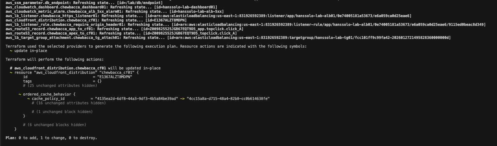
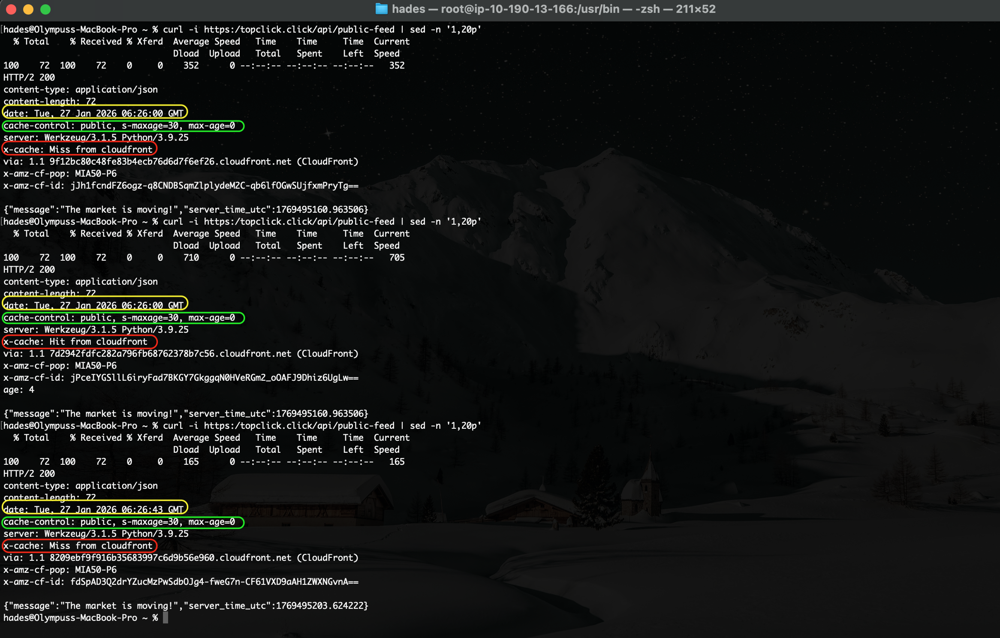

## Student Submissions:

1) Terraform diff showing the use of UseOriginCacheControlHeaders managed cache policy:
   >

2) Honors Verification, `curl -i` evidence showing:
    - Cache-Control present (bordered in green)
    - x-cache transitions (Miss → Hit → Miss), bordered in red
    - Note the times (highlighted in yellow), also note that the last `curl` command was ran over 35 seconds after the previous command.
   >

3) Paragraphs Answer:

	**Why Origin-Driven Caching is Safer?**
	Origin-driven caching (using the `UseOriginCacheControlHeaders` policy) is safer for APIs because it shifts control from the infrastructure (Terraform) to the application logic (Python). A "blunt" infrastructure policy might accidentally cache sensitive data (like a user's profile) or fail to cache public data (like a news feed). By letting the application set `Cache-Control: private` for sensitive endpoints and `public, max-age=30` for shared data, we ensure that caching decisions are granular and context-aware.

	**When to Disable Caching Entirely?**
	You should still disable caching entirely (using `Managed-CachingDisabled`) for APIs that are purely transactional or real-time critical. This includes endpoints that modify data (POST, PUT, DELETE requests), banking transaction feeds where "stale" data could cause financial loss, or highly dynamic systems where every millisecond of "freshness" matters (like real-time stock trading or chat applications).
