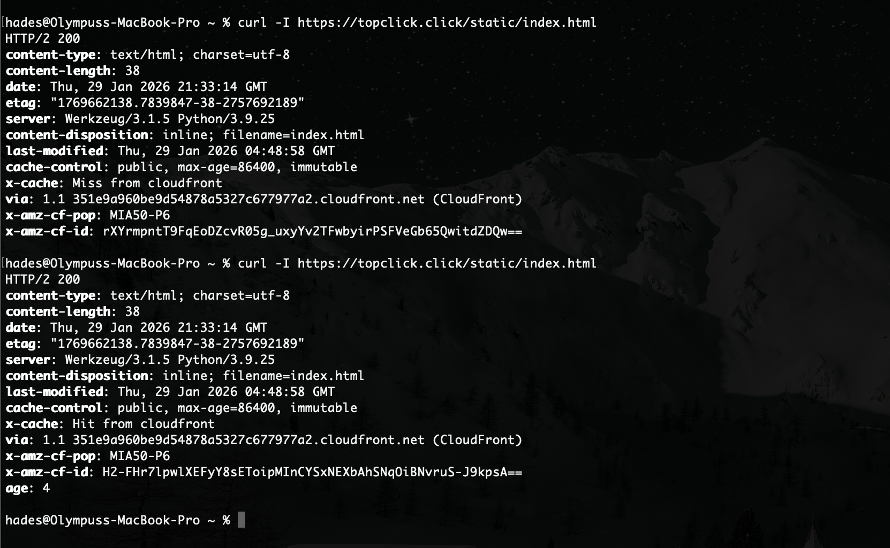
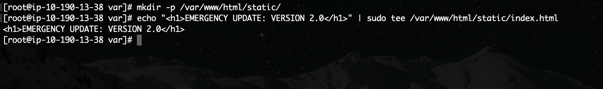
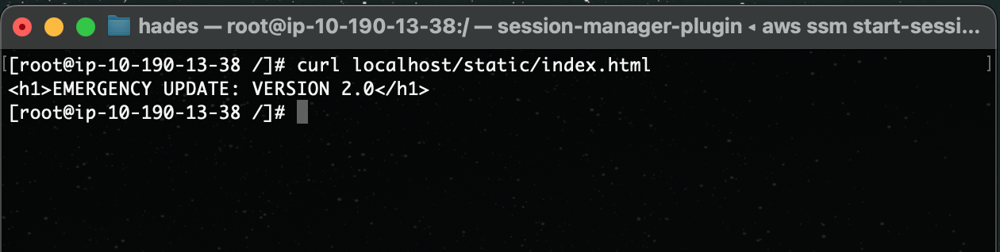
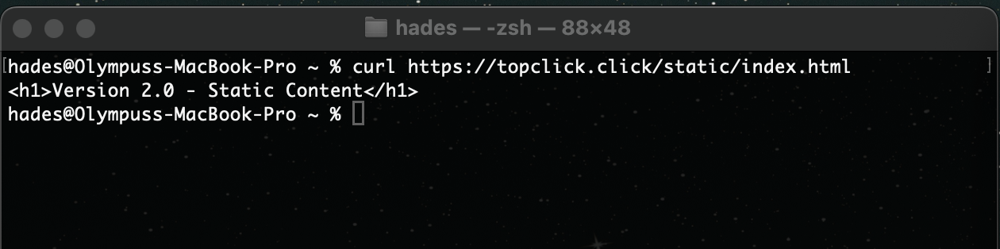
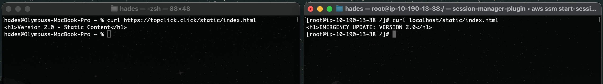
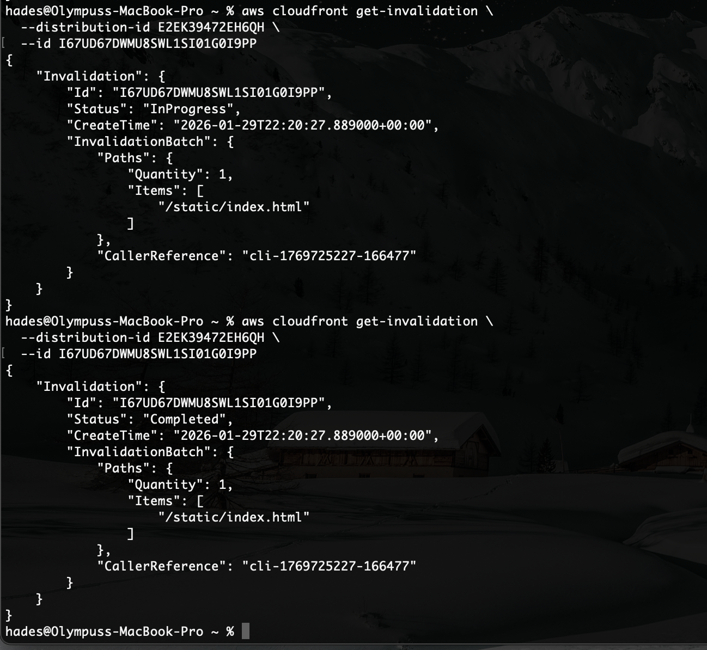
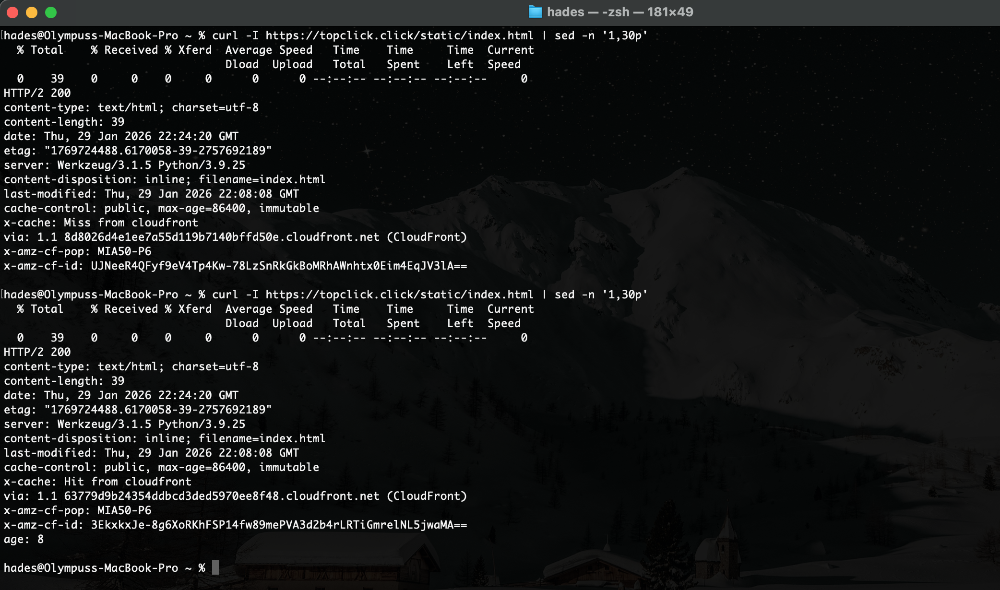
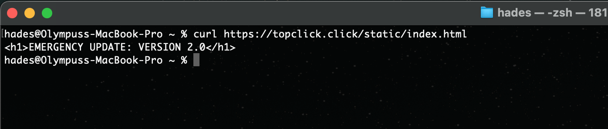
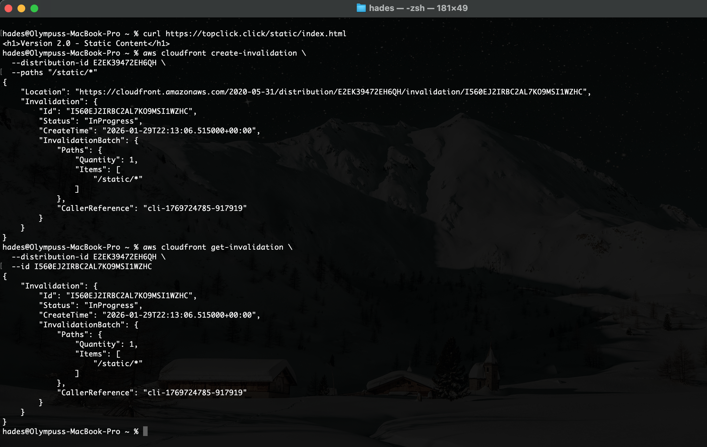

### The "Break Glass" Event Procedure

Before executing the "Break Glass" invalidation procedure, we first used the `curl` command to verify that the infrastructure—and more importantly, the distribution—was operational.

We requested the specific file to ensure it was stored in the Edge Location (Miami in this case). Note the successful `Miss` on the first request and the `Hit` on the second run (indicated by `x-cache`). Also, observe the `x-amz-cf-pop` header showing **MIA** (Miami) as the Point of Presence.

> 

#### The Break Glass Event

We then accessed the instance via SSM Session Manager to overwrite the `index.html` file with new content, simulating a backend deployment.

> 

Using the `curl` command locally on the instance to prove that the server **actually has** the new file.

> 

Proving that the old content is still cached in CloudFront and being served to the public internet despite the backend update:

> 

Side-by-side view (Local vs. Public):

> 

The invalidation command was then executed and monitored until the status reached `"Completed"`:

> 

Re-checking the cache status using the `curl -I` command. Note the initial `Miss` for the `x-cache` and the lack of an `Age` header on the first run. On the second run, we see `x-cache: Hit from cloudfront` with a low `age: 8`, confirming the new content has been freshly cached.

> 

Finally, the results of the successful "Break Glass" operation. Using `curl` on the `/index.html` public URL now shows the updated file contents:

> 

Evidence of the wildcard invalidation command (for documentation purposes):

> 

---

### Terraform Framework

I selected **Option 1: Manual Runbook Ops** for invalidations. A documentation file (`lab2b_honors_plus_invalidation_action.tf`) was added to the Terraform directory to enforce this policy.

**Reasoning for non-automated invalidations:**

1. **Operational Safety:** Automating invalidations on `terraform apply` clears the cache unnecessarily, causing "Thundering Herd" traffic spikes on the origin database/compute instances.
2. **Cost Control:** CloudFront charges per invalidation path after the first 1,000 per month.
3. **Immutability:** We prefer versioning assets (e.g., `app.v2.js`) rather than relying on cache-clearing mechanisms.

---

### Incident Scenario: "Stale index.html after deployment"

**Incident Report**

* **Symptoms:** Users reported receiving the old `index.html` file, which referenced outdated, hashed static assets, effectively breaking the application UI.
* **Root Cause:** While static assets (`.js`, `.css`) were properly versioned, the `index.html` entry point was cached at the Edge with a TTL of 24 hours (`max-age=86400`). Verification via `curl -I` showed `x-cache: Hit` and an increasing `Age` header, confirming the stale cache.
* **Resolution:** Versioning the HTML entry point is generally unfeasible for users. Therefore, a targeted "Break Glass" invalidation was executed strictly for `/static/index.html` (avoiding a `/*` wildcard wipe).
* **Verification:** Post-invalidation tests confirmed an `x-cache: Miss` and the successful delivery of the new V2 content to the end user.

---

### "Smart" Upgrade (Invalidation Policy & Budget)

**E1. When to Version vs. When to Invalidate**

* **Version:** For frequently updated static assets (e.g., `/static/app.9f3c1c7.js`, images, CSS), we utilize **Versioning**. By changing the filename, CloudFront treats it as a completely new object, instantly bypassing the old cache without requiring an invalidation.
* **Invalidate:** We strictly reserve invalidations for static entry points (like `index.html`), security incidents, or legal takedowns where the filename cannot be changed.

**E2. Invalidation Budget & Wildcard Approval Workflow**

* **Monthly Budget:** We allocate a soft budget of **200 invalidation paths per month** (well below the AWS 1,000 free tier limit) to control costs and monitor deployment efficiency.
* **The "Chewbacca Rage" Rule (`/*` Restriction):** Wildcard invalidations (e.g., `/static/*`) are heavily restricted because they dump the entire cache, sending a massive wave of requests to the Tokyo origin.
* **Approval:** Any use of a `/*` invalidation requires documented approval from a Senior Engineer and must be accompanied by an Incident Report detailing why a surgical invalidation was insufficient.
