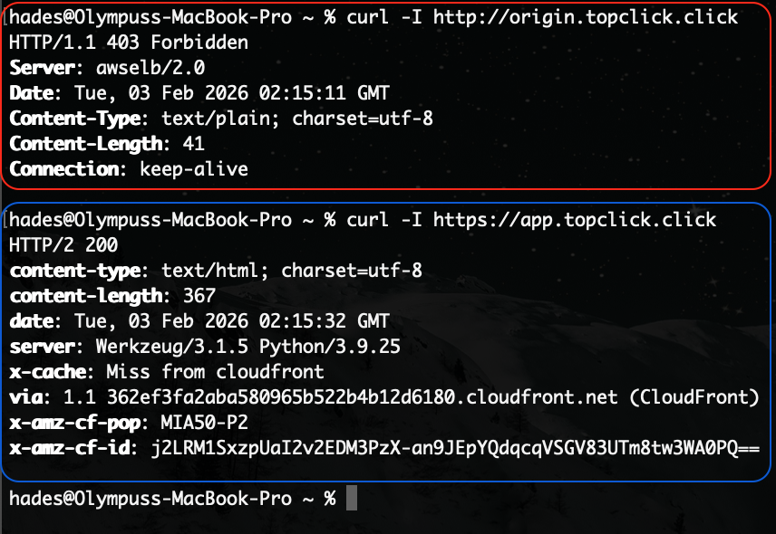
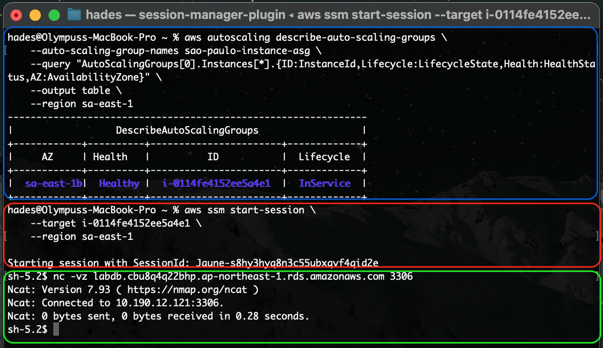
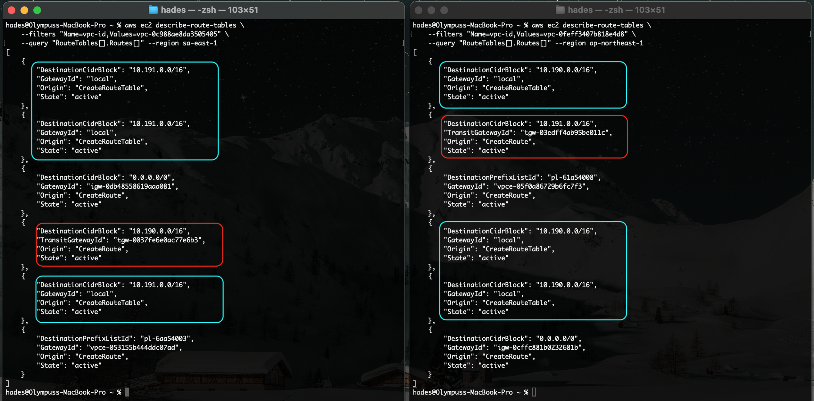
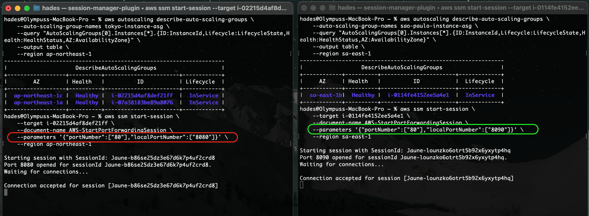
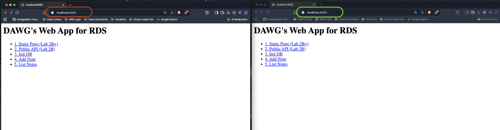
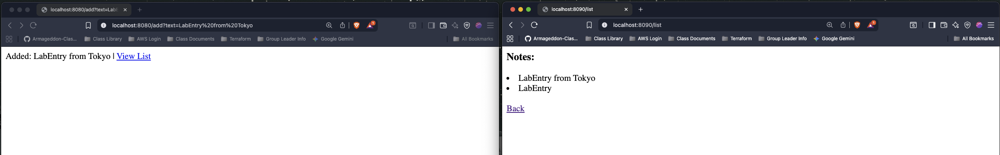
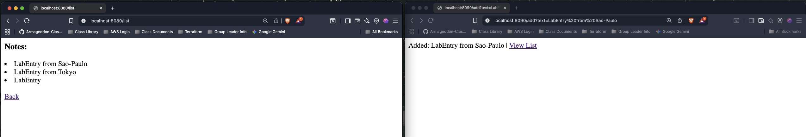
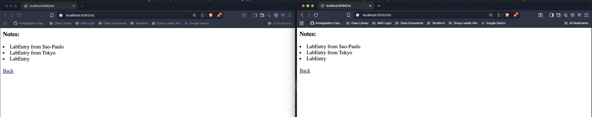

**The following are the results of the verification protocols that validate the integrity of the secure, multi-region DB architecture:**

#### 1. Confirming Application Load Balancer Protection

In this architecture, `http://origin.topclick.click` was assigned as the ALB DNS name (for each region's ALB) to allow for proper Route 53 latency-based routing. However, this DNS name should **only** allow access via the CloudFront DNS (accessed via the public domains `https://app.topclick.click` or `https://topclick.click`). Consequently, direct access to the `http://origin.topclick.click` domain should yield a **403 Forbidden** error, proving that the origin is protected.

See the results below comparing the use of `curl` to visit the ALB DNS names directly (bordered in red) versus accessing the DNS name assigned to the CloudFront Distribution (bordered in blue):

> 

Note the successful **200 OK** return from the `https://app.topclick.click` visit, versus the **403 Forbidden** message from the direct `http://origin.topclick.click` visit.

Additionally, note that these `curl` commands were run from **Jamaica**. Since Route 53 latency-based routing was configured, it is expected that the `x-amz-cf-pop` header indicates the specific CloudFront Point of Presence (Edge Location) in **MIA** (Miami), which is the nearest edge location to the request origin.

---

#### 2. Verifying Cross-Region Connectivity

As explained previously, this infrastructure setup allows the compute application in São Paulo to communicate with the database—which resides **only** in Tokyo—over the private AWS backbone. This adheres to the requirement of persisting PHI solely in the **Tokyo (ap-northeast-1)** region.

The example below verifies this connection by testing the TCP connectivity to the Tokyo RDS endpoint from an EC2 instance in São Paulo.

1. The São Paulo instance ID was obtained based on the ASG used to create it (bordered in blue).
    
2. SSM Session Manager was used to connect to the instance in São Paulo (bordered in red).
    
3. The command `nc -vz <tokyo-rds-endpoint> 3306` was used to successfully connect to the DB in the Tokyo region (bordered in green).
    

> 

**N.B.** Note the `10.190.12.121` IPv4 address for the database (DB). The Tokyo VPC was created using the `10.190.0.0/16` CIDR range; since the DB resides in the Tokyo VPC, it correctly possesses an IPv4 address that is a subset of that VPC's CIDR range.

More detailed evidence can be seen in the image below, which displays the route table information for the respective regions: **Tokyo** (right terminal) and **São Paulo** (left terminal). Please take special note of:

- The **Local** traffic in each region assigned to their respective Destination CIDR Blocks (bordered in blue).
    
- The **Transit Gateway IDs** in each region, where the destination CIDR blocks point to the CIDR of the peer region's VPC (bordered in red). This is critical for São Paulo to access the DB living in Tokyo.
    

> 

---

#### 3. Additional Verification using SSM Session Manager

For verification at the application level, SSM Session Manager was used to connect to the applications running in each region via **SSM Port Forwarding**. This allowed us to interact with the application via a local browser by tunneling to port 80 on the remote instances.

The image below shows the SSM Port Forwarding session established with an instance in each region in two different terminal windows: **Tokyo on the left** and **São Paulo on the right**.

- **Tokyo:** Port 80 is mapped to local port **8080** (bordered in red).
    
- **São Paulo:** Port 80 is mapped to local port **8090** (bordered in green).
    
> 

With SSM Port Forwarding active, we can showcase the application running on the Tokyo instance (left browser window) and the São Paulo instance (right browser window). Note the localhost port mappings correspond to the terminal sessions above: Tokyo at `localhost:8080` (bordered in red) and São Paulo at `localhost:8090` (bordered in green).
> 

**Read/Write Verification:**

Below is evidence showing information being **written** to the database via the instance in Tokyo and successfully **retrieved** by the instance in São Paulo.

> 

Below is evidence of the reverse, where the São Paulo instance **writes** to the DB in Tokyo, and the Tokyo instance application **reads** the written information.

> 

Finally, evidence of the application in **both regions reading the same information** simultaneously from the single DB source in Tokyo.

> 